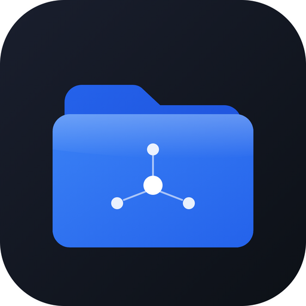

<p align="center">
  
</p>

<h1 align="center">QuickFolder</h1>

<p align="center">
  <strong>macOS 폴더를 빠르게 관리하는 가장 쉬운 방법</strong>
</p>

<p align="center">
  <a href="https://github.com/don-key/quickfolder/releases/latest"></a>
  
  
  
  <a href="https://github.com/don-key/quickfolder/stargazers"></a>
</p>

---

## What is QuickFolder?

자주 사용하는 폴더를 **한 곳에 모아두고**, 마우스를 화면 상단에 올리면 **즉시 접근**할 수 있는 macOS 유틸리티입니다.

> 폴더를 찾느라 Finder를 헤매지 마세요. QuickFolder로 **1초 만에** 원하는 폴더를 여세요.

---

## Features

| 기능 | 설명 |
|------|------|
| **Hot Edge** | 마우스를 화면 상단에 올리면 자동으로 QuickFolder가 나타남 |
| **콤팩트 UI** | 폴더를 태그 형태로 가로 나열, 작고 빠른 인터페이스 |
| **워크스페이스** | 폴더를 그룹별로 정리 (업무, 개인, 프로젝트 등) |
| **멀티 모니터** | 커서가 있는 디스플레이에서 창이 열림 |
| **싱글클릭 열기** | 폴더 클릭 한 번으로 Finder에서 바로 열림 |
| **터미널 열기** | 우클릭 → 터미널에서 바로 해당 폴더 진입 |
| **핀 고정** | 고정 시 마우스가 벗어나도 창이 유지됨 |
| **자동 숨김** | 마우스 이탈 시 자동으로 창이 닫힘 |
| **드래그 정렬** | 워크스페이스 순서를 드래그로 변경 |
| **메뉴바 상주** | 트레이 아이콘으로 항상 빠르게 접근 |

---

## Quick Start

### Homebrew (권장)

```bash
brew tap don-key/quickfolder
brew install --cask quickfolder
```

### DMG 설치

1. [**최신 DMG 다운로드**](https://github.com/don-key/quickfolder/releases/latest)
2. DMG 파일 열기
3. `QuickFolder`를 `Applications` 폴더로 드래그
4. 실행!

### macOS 보안 경고 해결

코드사이닝이 없어 "손상되었기 때문에 열 수 없습니다" 경고가 뜰 수 있습니다. 아래 명령어로 해제하세요:

```bash
xattr -cr /Applications/QuickFolder.app
```


### 소스에서 실행 (개발자용)

```bash
git clone https://github.com/don-key/quickfolder.git
cd quickfolder
npm install
npm start
```

---

## How to Use

| 동작 | 방법 |
|------|------|
| 폴더 추가 | 📁+ 버튼 클릭 → 폴더 선택 |
| 폴더 열기 | 폴더 **클릭** → Finder에서 열림 |
| 터미널 열기 | 폴더 **우클릭** → 터미널에서 열기 |
| 이름 변경 | 폴더 **우클릭** → 이름 변경 |
| 폴더 제거 | 폴더 **우클릭** → 제거 (실제 삭제 아님) |
| 워크스페이스 추가 | 🔲+ 버튼 클릭 |
| 워크스페이스 정렬 | 탭 **드래그** |
| Hot Edge | 마우스를 **화면 최상단**에 올리면 자동 팝업 |
| 핀 고정 | 📌 버튼 → 마우스 나가도 창 유지 |
| 자동화 권한 | ⚙️ 버튼 → macOS 설정으로 이동 |

---

## Build (DMG 생성)

```bash
npm run build
```

`dist/` 폴더에 macOS용 `.dmg` 파일이 생성됩니다.

---

## Requirements

- **macOS** 10.15+
- 소스 빌드 시: **Node.js** 18+, **npm** 9+

---

## Support

QuickFolder가 마음에 드셨다면 ⭐ **Star**를 눌러주세요!

---

## License

MIT License - 자유롭게 사용하세요.

---

<p align="center">
  <sub>Made with Electron & Claude Code</sub>
</p>
